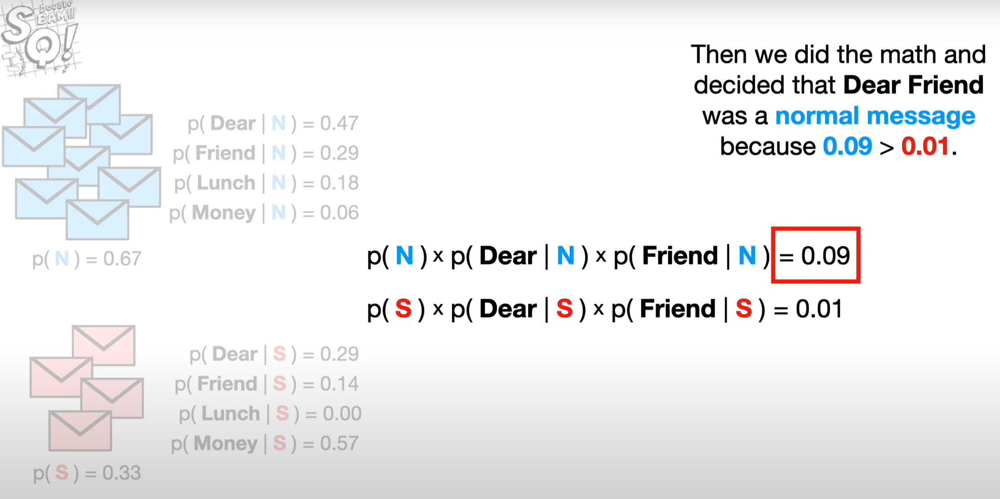

```{r message=TRUE, warning=TRUE, include=FALSE}
library(tidyverse)
```


## Classification vs clustering

```{r echo=FALSE}
classification <- c("supervised form of machine learning", "class label is known", "have prior information", "identifies objects based on similar features", "training, testing and validation phases")

clustering <- c("unsupervised form of machine learning", "class label not known", "may not have prior information", "arranges similar objects together", "example: clustering countries by continent")

tibble(classification, clustering)
```

## Naive Bayes classifiers

There are two types of naive Bayes Classifiers:

    - multinomial
    - gaussian 
  
For the purposes of this assignment, we will focus on `multinomial` Bayes classifiers.

As the name suggests, this is a classification and not a clustering method.

**Multinomial Naive Bayes Classifier**

Naive Bayes uses probability for the purpose of classification. It can be applied to datasets that have discrete and countable features, some examples are:

  - customer segmentation (e.g. counting the occurences of types of purchases and classifying customers as 'accessory shoppers' or 'casual shoppers')
  - image classification (e.g. counting the features of an image and using these features to identify the image)
  - natural language processing (e.g. customer review classed as either 'positive' or 'negative')
  
**Example - spam email**

The naive Bayes classification process can help us identify whether an email we recieve is either 'spam' or 'not spam'. 

To do this we would use a training set of emails and look at the recurrence of words within each email. We would already have decided which of these emails were spam and which were not spam before creating our classification model. It is common to use the probability from our training set of not spam and spam to calculate the first part of our equation which is our 'initial guesses'. 

For example, if we have 50 emails and 30 of them are not spam, we would have an initial guess that the probability of the email not being spam is 0.6. 

Likewise, the remaining 20 emails are spam, so our initial guess for the probability of spam emails is 0.4.

We would then calculate the probability for every word that appears within the emails in our dataset. To do this we would first look at the not spam emails and calculate the total number of words in all of these emails. We then count the occurence of each unique word and divide this by the total number of words to get a probability for each unique word.

This process is then repeated for spam emails. 

We then build our equations that will help us determine whether an email is not spam or spam:

Equation 1: 
p(notspam) * p(word1) * p(word2) *...p(wordn) ∝ p(notspam) given word1, word2... wordn included

Equation 2:
p(spam) * p(word1) * p(word2)...p(wordn)∝ p(spam) given word1, word2... wordn included

These two scores are compared and the highest score, i.e. the version with the highest probability, is the score that 'wins'. 

E.g. if equation 1 = 0.8 and equation 2 = 0.45 then the email would be classed as not spam. 

*Note: When looking at our test data and assigning counts to each word (in this case each word that appears in an email) we assign a "black box" count for each word. For example, if the word "sugar" appeared five times in non-spam emails, but 0 in spam, we would count 6 for good emails and 1 for spam. This ensures that an email with the word 'sugar' will never nullify our second equation, i.e. in this case there will never be a word that will be multiplied by 0, therefore the sum of our equation 2 will never be 0.*

*Our "black box" count can be set to any value. A count should not be added to the initial guess, this should only be added to the training data.*



**Why naive?**

Treats data orders the same regardless of order. Treat language like it is random and does not apply structure. 

High biased as it ignores the relationship between the data, but tends to work well in practice so low variance. 


**Strengths:**

    - large datasets not necessary
    - simple
    - fast
    - low variance
  
**Weaknesses:**

    - naive!
    - does not consider order/hierarchy
    - high bias

